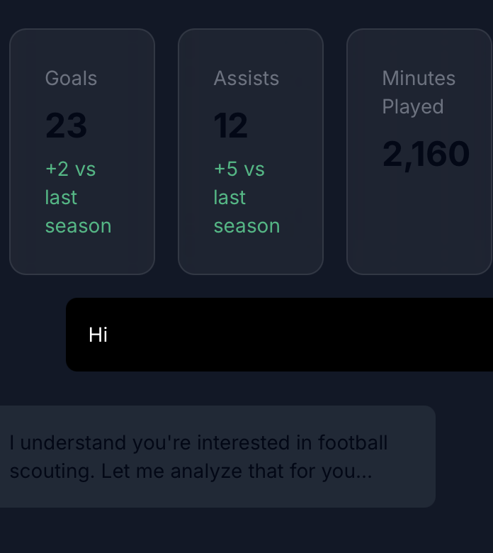

# Things to implement

Can you make this visible in dark mode please.

That's great, For user sign up, instead of asking for username, can you ask for 'Display Name' and make the same changes in the Supabase tables. Also, can you make the profile name in the left pane the same as the Display Name of the user logging in (ie replace 'Sai Amruth' and the circle next to it with the Name of the user and their Initials in the circle).

Also, time to connect chat with LLM response

Research on which tools to use in rendering Compare Graphs (check out Sqwuaka), The athletic style bar + Scatter Plot etc etc. Heat map and everything. Render with !Graph and !Table !Map, etc, save as Image (and/or Python code if possible)

-Working On Backend

Research on multi modal graph and Image generation with OpenAI, else others.

LLM Connect - https://platform.openai.com/docs/api-reference/streaming

API Search for reliable (pref. real time football data)

Need to add backend to get data through this lib https://github.com/JaseZiv/worldfootballR.

