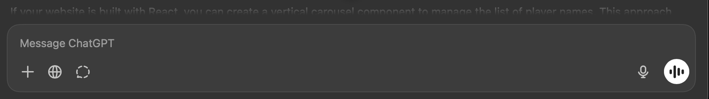

#Things to implement

This is brilliant, now can you make the text visible even in the side panels, ie the list of chats and in the analysis pane, and can you also make the attachment icon and send icon off white in the dark mode for visibility

Need to add backend to get data through this lib https://github.com/JaseZiv/worldfootballR.

